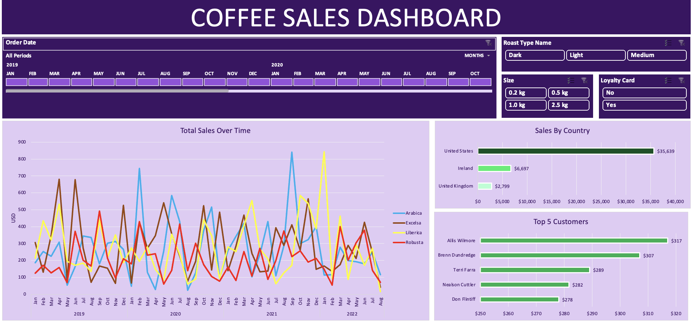

# Coffee Sales Dashboard (Excel)

An interactive sales dashboard built in Excel to analyze 1,000 coffee orders across three years, using PivotTables, PivotCharts, and slicers to let a user filter sales by coffee type, roast, country, and loyalty status without touching a formula.

## The business question

A coffee retailer wants to know: which products, markets, and customers are actually driving revenue, and where should marketing dollars go next. This dashboard answers that from raw transaction data with zero manual reporting.

## What's in the data

- **1,000 orders** from Jan 2019 to Aug 2022
- **3 linked tables**: orders, customers, products (customer ID and product ID as keys)
- **16 fields per order**: date, customer, product, coffee type, roast, size, unit price, sales, loyalty status, country

## Key findings

- Total revenue across the dataset: **$45,134**
- **United States drives 79% of revenue** ($35,639), with Ireland a distant second ($6,697) and the UK third ($2,799) — the business is US-concentrated, which is either an opportunity to double down or a risk if that market softens
- **Excelsa is the top-selling coffee type** ($12,306), narrowly ahead of Liberica ($12,054) and Arabica ($11,768) — the four types are actually close, so there's no single "hero product" carrying the business
- **Loyalty card holders are a near-even split** with non-holders (48%/52%), suggesting the loyalty program isn't yet a strong purchase driver — worth testing incentives to shift that ratio

## How the dashboard works

- **PivotTables** aggregate raw order data into sales-by-coffee-type, sales-by-country, and top-5-customer views
- **PivotCharts** visualize each of those breakdowns
- **Slicers** let the user filter the entire dashboard live by coffee type, roast, or loyalty status
- **Data model**: orders table pulls customer and product details via lookups, so the whole dashboard updates from a single source of truth

## Tools used

Excel (PivotTables, PivotCharts, Slicers, data modeling)
